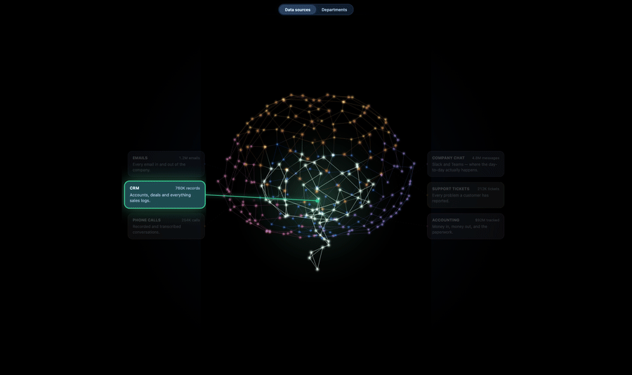

<a href="https://kobimantzur.github.io/company-brain-3d/"></a>

<p align="center">
  <a href="https://github.com/kobimantzur/company-brain-3d/actions/workflows/ci.yml"></a>
  <a href="https://www.npmjs.com/package/company-brain-3d"></a>
  <a href="https://www.npmjs.com/package/company-brain-3d"></a>
  <a href="LICENSE"></a>
</p>

<p align="center">
  <b>A 3D brain explorer for your company's data.</b><br/>
  Drop in a JSON tree and fly from departments down to a single neuron.<br/>
  <a href="https://kobimantzur.github.io/company-brain-3d/"><b>Live demo →</b></a> ·
  <a href="docs/GUIDE.md">Docs</a> ·
  <a href="brain.schema.json">Schema</a>
</p>

---

Built for people building a **company brain** — and the AI agents helping them. Works for anything
hierarchical: knowledge bases, data catalogs, ontologies, taxonomies, org charts, product trees.

> Not a graph library. Force-directed blobs are a solved problem — this is a **hierarchy you can fly into**.

```bash
npm i company-brain-3d three @react-three/fiber @react-three/drei
```

```tsx
import { CompanyBrain } from 'company-brain-3d'
import 'company-brain-3d/style.css'

<CompanyBrain data={brain} height="auto" />
```

That's the whole integration. `brain` is a tree — every node needs a `title`, everything else is optional:

```json
{
  "version": 1,
  "title": "Northwind Systems",
  "children": [
    {
      "id": "sources",
      "title": "Data sources",
      "children": [
        {
          "id": "emails",
          "title": "Emails",
          "description": "Every email that comes in or goes out.",
          "value": "1.2M emails",
          "region": "frontal",
          "color": "#3b82f6",
          "children": [
            { "id": "shared", "title": "Shared inbox", "description": "Where customers write in.", "value": "380K" },
            { "id": "reps", "title": "Personal mailboxes", "description": "Each person's own inbox.", "value": "740K" }
          ]
        },
        { "id": "crm", "title": "CRM", "description": "Accounts, deals and activity.", "value": "760K records", "region": "stem" }
      ]
    },
    {
      "id": "departments",
      "title": "Departments",
      "children": [
        { "id": "sales", "title": "Sales", "description": "Who we sell to and how the pipeline looks.", "value": "64 people" }
      ]
    }
  ]
}
```

**Depth 1** is the lens toggle. **Depth 2** are the brain's regions, one card each — 5–8 reads best.
**Deeper** is anything you like; children claim a sub-cluster of their parent's dots, so the hierarchy is
literally spatial. **Leaves** are single neurons.

## Generating one with an LLM

The schema is the shape a model already wants to emit. Paste this into Claude, ChatGPT or Gemini and feed
the result straight to the component — no glue code:

```
Output a company-brain JSON describing my organisation. Schema:
{ "version": 1, "title": string, "children": Node[] }
Node = { "id": string (unique), "title": string, "description"?: string (one plain line),
         "value"?: string (a headline figure like "65K emails"), "color"?: "#rrggbb",
         "region"?: "frontal"|"temporal"|"parietal"|"occipital"|"stem" (depth-2 only),
         "children"?: Node[] }
Depth 1 = lenses (e.g. "Data sources", "Departments"). Depth 2 = regions, 5-8 of them.
Deeper = anything. Leaves are single neurons. Keep descriptions non-technical.
My organisation: <describe it>
```

## Props

| Prop | Default | What it does |
|---|---|---|
| `data` | — | The tree |
| `onSelect` | — | `(node, path) => void`, on every zoom-in |
| `height` | `100%` | Any CSS length, or `auto` to size itself |
| `theme` | `dark` | `light` for light pages: ink on paper instead of glow on black |
| `background` | per theme | Any CSS colour, or `transparent` |
| `palette` | 8 colours | For segments without their own `color` |
| `scrollZoom` | `false` | Off, so the page keeps scrolling over the canvas |

[Full props, theming, embedding and limits →](docs/GUIDE.md)

## Not on React 19?

`@react-three/fiber@9` needs React 19. For React 18, Vue, or plain HTML there's a self-contained bundle:

```bash
npm run build:embed        # → dist-embed/
```

```html
<iframe src="/brain/standalone.html?height=auto" style="width:100%;height:560px;border:0"></iframe>
```

Contributions welcome — see [CONTRIBUTING.md](CONTRIBUTING.md). Using this from an AI agent? [AGENTS.md](AGENTS.md).

MIT · [Guide](docs/GUIDE.md) · [Schema](brain.schema.json) · [Changelog](CHANGELOG.md)
